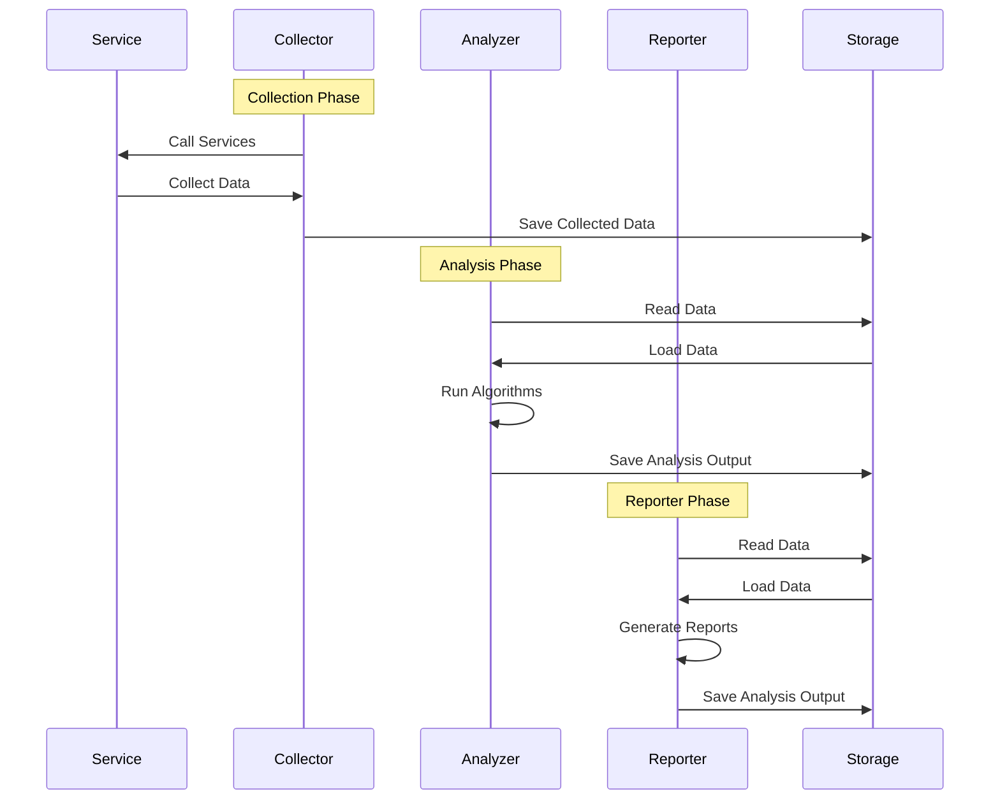

  

# serviceauditreport
A tool for auditing and reporting on the configuration compliance of various services

This project is under development and is in a non-working state.

## Process

The serviceauditreport application is comprised of threee independent applications that are used in conjunction to generate the reports.  This divides the work into three distinct phases.

**Collector**: The collector is responsible for calling out to services to collect data.  This data is stored for use in the successive phases.

**Analyzer**: The analyzer loads the data that was stored in the collection phase and generates additional derived data that is built on top of the original data.

**Reporter**: The reporter loads in the data from both the collection and analyzer phases and generates reports that are the final product for consumption.

